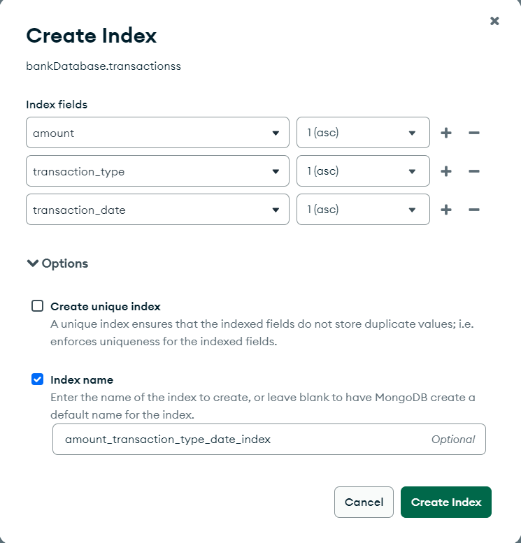
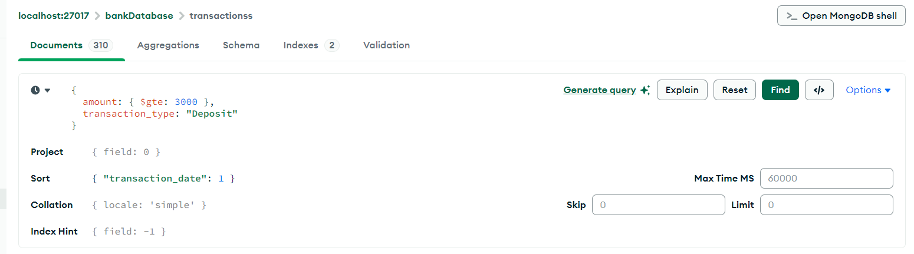
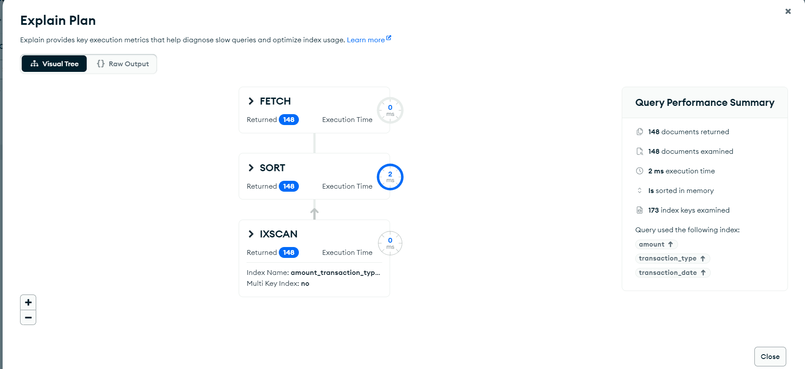
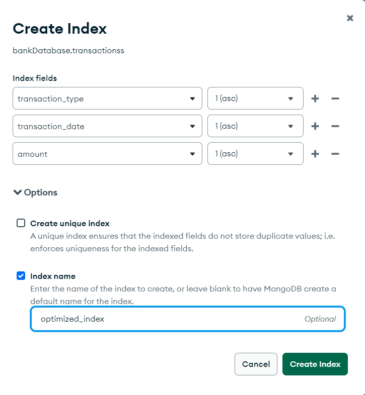
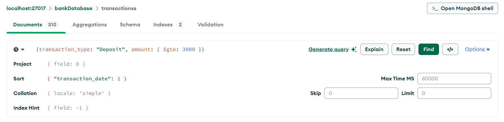
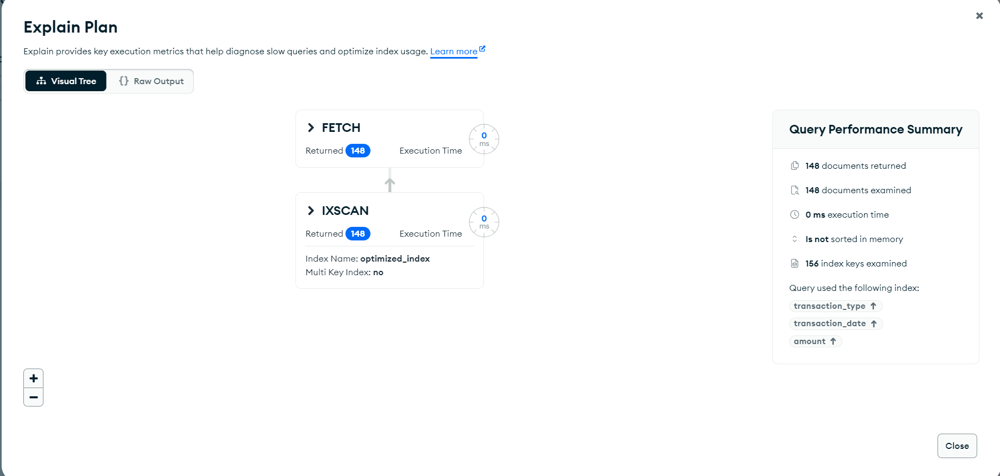

# **MongoDB ESR Rule(Equality, Sort, Range)**

## **Table of Contents**

- [Introduction](#introduction)

- [Why was ESR introduced?](#why-was-ESR-introduced)

- [Why is the order ESR followed](#why-is-the-order-ESR-followed)

- [Before ESR](#Before-ESR)

- [After ESR](#After-ESR)

- [Comparison](#Comparison)

---

## **Introduction**

The **ESR Rule** in MongoDB stands for **Equality, Sort, Range**, a set of principles to design and utilize indexes efficiently for query optimization. Following this rule ensures that indexes are used effectively to minimize query execution time and improve performance.

- **Equality:** Prioritize fields with exact matches first to reduce the dataset quickly.
- **Sort:** Include fields used for sorting next to avoid in-memory sorting.
- **Range:** Add fields with range filters last, as they are less restrictive.

---

## **Why was ESR introduced?**

MongoDB indexes are designed to process queries efficiently, but not all queries utilize indexes effectively.

**Challenge:** Queries with multiple conditions (equality, sorting, and range) often failed to fully utilize compound indexes, leading to slower performance.

**Solution:** The ESR rule provides a structured approach to query design that matches how MongoDB's query planner and index structures operate, ensuring maximum performance.

---

## **Why is the order ESR followed**

The order **ESR (Equality, Sort, Range)** is used in MongoDB because it aligns with how its query planner evaluates and optimizes queries for maximum efficiency. Here’s why the order matters:

1. **Equality (E)**  

    -  Equality conditions (e.g., `field = value`) are the most restrictive and quickly reduce the dataset to relevant matches.  
 
    -  By narrowing down the dataset early, it minimizes the work required for sorting or evaluating ranges.  


2. **Sort (S)**  

    -  After equality filtering, sorting can be done more efficiently on the reduced dataset.  
 
    -  If the sort order matches the index order, MongoDB can sort without additional processing, avoiding slow in-memory sorting.  


3. **Range (R)**  
 
    -  Range conditions (e.g., `field > value`, `field < value`) are less restrictive and often result in larger datasets.  
 
    -  Placing range queries last ensures that they are applied only after equality filtering and sorting, making the query faster and more efficient.

---

## **Before ESR** 


### **Scenario**

Find transactions where:
1. The `amount` is greater than or equal to `$3000` (**Range**).
2. The `transaction_type` is `"Deposit"` (**Equality**).
3. The results are sorted by `transaction_date` in ascending order (**Sort**).


### **Step-by-Step Guide**

1. **Create an Index**
   - Navigate to the `Indexes` tab in MongoDB Compass for your collection (`transactions`).
   - Click **`Create Index`**.
   - Add the following fields:
     - `amount` as **Ascending (1)**.
     - `transaction_type` as **Ascending (1)**.
     - `transaction_date` as **Ascending (1)**.
   - Name your index (e.g., `amount_transaction_type_date_index`).
   - Click **`Create Index`**.
   - 


2. **Run the Query**
   - Go to the **`Documents`** tab.
   - Click on **`Type a query`** and enter the following query:
     ```javascript
     { amount: { $gte: 3000 }, transaction_type: "Deposit" }
   
     ```
     - Click on `options`
    ```javascript
     sort
      { transaction_date: 1 }
    ```
   - Click **`Find`**.
   - 


3. **Explain Plan**
   - Click on **`Explain Plan`** to analyze the query.
   - You will notice MongoDB scans the `amount` field first, filters `transaction_type`, and performs in-memory sorting on `transaction_date`.
   - **Drawbacks**: Increased execution time and resource usage.
   - 


### **Issues**

- **Inefficient Index Scan**: MongoDB starts with the `amount` field, which is less restrictive than `transaction_type`. This results in a larger dataset being processed before filtering.
- **In-Memory Sorting**: Sorting on `transaction_date` is performed in memory, increasing resource usage.
- **Poor Performance**: With large datasets, this approach can lead to slower queries and higher memory consumption.


---

## **After ESR**


### **Optimized Query (After ESR)**
To optimize, follow the ESR order:
1. **Equality**: `transaction_type = "Deposit"` should come first.
2. **Sort**: `transaction_date` should come next.
3. **Range**: `amount >= 3000` should be evaluated last.


### **Step-by-Step Guide**


1. **Create an Optimized Index**
   - Go to the `Indexes` tab and click **`Create Index`**.
   - Add the following fields:
     - `transaction_type` as **Ascending (1)**.
     - `transaction_date` as **Ascending (1)**.
     - `amount` as **Ascending (1)**.
   - Name your index (e.g., `optimized_index`).
   - Click **`Create Index`**.
   - 


2. **Run the Optimized Query**
   - Go to the **`Documents`** tab.
   - Enter the same query:
     ```javascript
     { transaction_type: "Deposit", amount: { $gte: 3000 } }
     ```
   - Click on `options`
    ```javascript
     sort
      { transaction_date: 1 }
    ```
   - Click **`Find`**.
   - 


3. **Explain Plan**
   - Click on **`Explain Plan`** again.
   - MongoDB will use the optimized index:
     - First, it filters by `transaction_type = "Deposit"`.
     - Then, it sorts by `transaction_date`.
     - Finally, it filters `amount >= 3000`.
   - **Benefits**: Faster query execution with no in-memory sorting or filtering.
   - 


### **Benefits**
- **Efficient Index Usage**: The query fully utilizes the index.
- **No In-Memory Sorting**: Sorting is handled by the index.
    - **Note:** If MongoDB does in-memory sorting, all documents stored on disk are read into RAM, then a sorting algorithm is performed. In-memory sorting is inefficient, time-consuming & sorting a large number of documents in memory is quite expensive. Moreover, MongoDB aborts the operation if memory usage is more than 32MB.
- **Improved Performance**: Faster query execution, even on large datasets.

---


## **Comparison**


| Aspect                  | Before ESR                          | After ESR                           |
|-------------------------|--------------------------------------|-------------------------------------|
| **Index**               | `{ amount: 1, transaction_type: 1, transaction_date: 1 }` | `{ transaction_type: 1, transaction_date: 1, amount: 1 }` |
| **Execution**           | Scans `amount` first, sorts in memory | Filters `transaction_type` first, sorts using index |
| **Sorting**             | In-memory sorting                   | Index-based sorting                 |
| **Performance**         | Slow, high resource usage           | Fast, efficient                     | 

